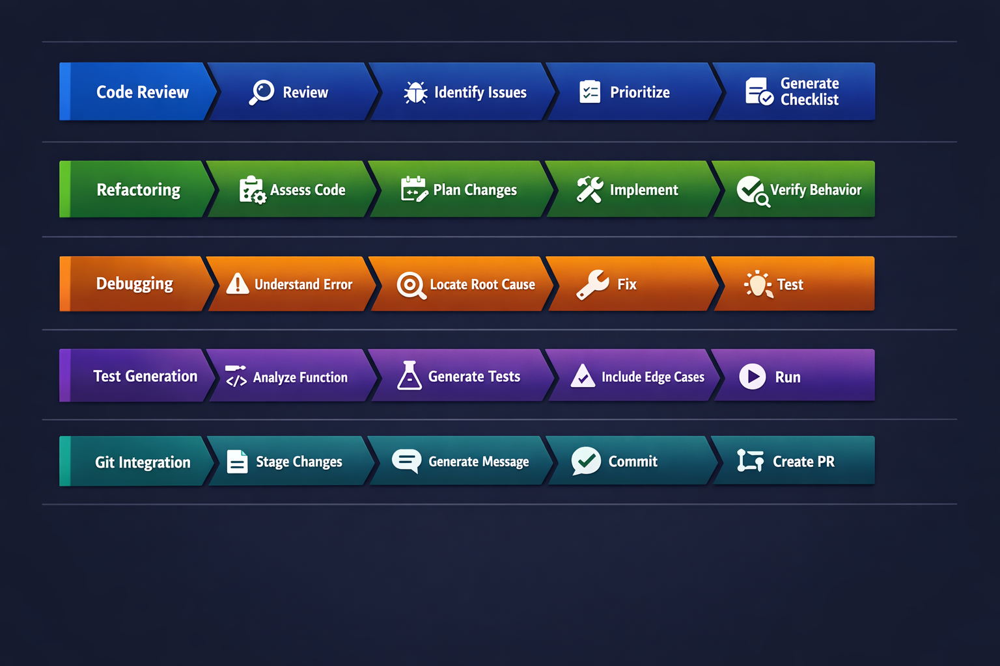

> **What if the AI could find bugs you didn't even know to ask about?**

In this chapter, GitHub Copilot CLI becomes your daily driver. You'll learn the workflows you'll use constantly: running comprehensive code reviews, refactoring legacy code safely, debugging issues with AI assistance, generating tests automatically, and integrating Copilot with your git workflow. The "Bug Detective" demo shows AI finding related bugs you didn't even ask about. That's when it gets truly impressive.

## Learning Objectives

By the end of this chapter, you'll be able to:

- Run comprehensive code reviews with Copilot
- Refactor legacy code safely
- Debug issues with AI assistance
- Generate tests automatically
- Integrate Copilot with your git workflow

> ⏱️ **Estimated Time**: ~55 minutes (20 min reading + 35 min hands-on)

---

## Real-World Analogy: Master Craftsman's Workflow

A master carpenter doesn't just know how to use tools - they have *workflows* for different jobs:

| Job | Workflow |
|-----|----------|
| Building furniture | Measure → Cut → Assemble → Finish |
| Fixing damage | Assess → Remove → Repair → Match |
| Quality check | Inspect → Test joints → Check alignment |

Similarly, developers have workflows for different tasks. Copilot CLI enhances each one.

> 💡 **Important**: The workflows below are **independent tools**, not a mandatory sequence. Use whichever workflow fits your current task. You might do code review without debugging, or jump straight to test generation. There's no "correct" order.
>
> **Test-first developers**: If you practice TDD (Test-Driven Development), you'd typically start with Workflow 4 (Test Generation), then implement code, then use Workflow 1 (Code Review).


*The right tool for every development task: Code Review, Refactoring, Debugging, Testing, and Git Integration*



*Each workflow follows a clear progression of steps, all enhanced by Copilot CLI*

---

## Workflow 1: Code Review

### Basic Review

```bash
copilot

> Review @samples/src/api/users.js for code quality
```

### Security-Focused Review

```bash
copilot

> Review @samples/src/auth/login.js for security vulnerabilities. Check for: SQL injection, XSS, CSRF, insecure authentication, and sensitive data exposure
```

### Performance Review

```bash
copilot

> Review @samples/src/services/userService.js for performance issues. Look for: unnecessary loops, memory leaks, inefficient algorithms, and blocking operations
```

### Interactive Code Review

```bash
copilot

> @samples/src/api/users.js Review this file for:
> - Security vulnerabilities
> - Performance issues
> - Code style and best practices

# Copilot provides detailed review

> The SQL injection on line 23 - show me the fix

# Copilot shows the parameterized query fix

> Create a checklist of all issues found, prioritized by severity

# Copilot generates prioritized action items
```

### Review Checklist Template

```bash
copilot

> Review @samples/src/api/ and create a markdown checklist of issues found, categorized by:
> - Critical (security vulnerabilities)
> - High (bugs, data corruption risks)
> - Medium (performance, maintainability)
> - Low (style, minor improvements)
```

### Understanding Git Changes (Important for /review)

Before using the `/review` command, you need to understand two types of changes in git:

| Change Type | What It Means | How to See |
|-------------|---------------|------------|
| **Staged changes** | Files you've marked for the next commit with `git add` | `git diff --staged` |
| **Unstaged changes** | Files you've modified but haven't added yet | `git diff` |

```bash
# Quick reference
git status           # Shows both staged and unstaged
git add file.js      # Stage a file for commit
git diff             # Shows unstaged changes
git diff --staged    # Shows staged changes
```

### Using the /review Command

The `/review` command invokes the built-in **code-review agent**, which is optimized for analyzing staged and unstaged changes with high signal-to-noise output:

```bash
copilot

> /review
# Invokes the code-review agent on staged/unstaged changes
# Provides focused, actionable feedback

> /review Check for security issues in authentication
# Run review with specific focus area
```

> 💡 **Tip**: The code-review agent works best when you have pending changes. Stage your files with `git add` for more focused reviews.

---

## Workflow 2: Refactoring

### Simple Refactoring

Start with straightforward improvements. Try these on the sample file:

```bash
copilot

> @samples/src/refactor-me.js Rename the variable 'x' to something more descriptive
> @samples/src/refactor-me.js The processOrder function is too long. Split it into smaller functions.
> @samples/src/refactor-me.js Remove any unused variables
```

> 💡 **New to refactoring?** Start with simple requests like renaming variables or removing duplication before tackling complex transformations.

### Callback to Async/Await

```bash
copilot

> @samples/src/services/userService.js This file uses callbacks. Refactor to async/await while:
> - Maintaining the same function signatures
> - Preserving error handling behavior
> - Adding TypeScript types
```

<details>
<summary>🎬 See it in action!</summary>


</details>

### Extract Duplication

```bash
copilot

> @samples/src/services/userService.js @samples/src/services/productService.js
> These files have duplicated error handling. Extract a common error handler.
```

### Modernize Legacy Code

```bash
copilot

> @samples/src/services/userService.js Modernize this code:
> - Convert var to const/let
> - Use arrow functions where appropriate
> - Replace .then() chains with async/await
> - Add JSDoc comments
```

### Safe Refactoring with Tests

```bash
copilot

> @samples/src/utils/helpers.js Before refactoring, generate tests for current behavior

# Get tests first

> Now refactor the module to use date-fns instead of moment.js

# Refactor with confidence - tests verify behavior is preserved
```

---

## Workflow 3: Debugging

### Simple Debugging

Start by describing what's wrong. Here are common debugging patterns you can try with the sample files:

```bash
copilot

# Pattern: "Expected X but got Y"
> @samples/buggy-code/js/userService.js The login function should reject invalid users, but it's not. Why?

# Pattern: "Error message + location"
> @samples/src/utils/helpers.js I'm getting "undefined is not a function" when calling formatDate. What's wrong?

# Pattern: "Unexpected behavior"
> @samples/buggy-code/js/paymentProcessor.js The total calculation seems wrong. Help me find why.
```

> 💡 **Debugging tip**: Describe the *symptom* (what you see) and the *expectation* (what should happen). Copilot figures out the rest.

### The "Bug Detective" - AI Finds RELATED Bugs

This is where context-aware debugging shines. Try this scenario with a payments file:

```bash
copilot

> @samples/buggy-code/js/paymentProcessor.js
>
> Users report that $10.20 + $5.10 sometimes shows as $15.299999999999998
> Debug why this happens
```

<details>
<summary>🎬 See it in action!</summary>


</details>

**What Copilot does**:
```
Root Cause: Floating-point arithmetic issue in JavaScript.

Line 15: const total = amount1 + amount2
JavaScript represents numbers as 64-bit floating point, which can't
precisely represent some decimal values.

Fix: Use integer cents internally, convert for display only:
- Store amounts as cents (1020, 510)
- Calculate: 1020 + 510 = 1530
- Display: (1530 / 100).toFixed(2) = "$15.30"
```

**Why this matters**: Copilot reads the whole file, understands the context of your bug report, and gives you a specific fix with a clear explanation.

> 💡 **Bonus**: Because Copilot analyzes the entire file, it often discovers *other* issues you didn't ask about. Try it - you might be surprised what else it finds!

> 💡 **Common security terms you'll encounter:**
> - **SQL Injection**: When user input is put directly into a database query, allowing attackers to run malicious commands
> - **Parameterized queries**: The safe alternative - placeholders (`?`) separate user data from SQL commands
> - **Race condition**: When two operations happen at the same time and interfere with each other
> - **XSS (Cross-Site Scripting)**: When attackers inject malicious scripts into web pages

---

### Understanding an Error

```bash
copilot

> I'm getting this error:
> TypeError: Cannot read property 'map' of undefined
>     at Header (samples/src/components/Header.jsx:15:23)
>
> @samples/src/components/Header.jsx Explain why and how to fix it
```

### Debugging with Test Case

```bash
copilot

> @samples/buggy-code/js/paymentProcessor.js This endpoint returns 500 errors for this input:
> {"amount": -100, "currency": "USD"}
>
> Debug this: explain the root cause and provide a fix with input validation
```

### Trace an Issue Through Code

```bash
copilot

> Users report that user creation sometimes fails silently.
> @samples/src/services/userService.js @samples/src/api/users.js @samples/src/utils/helpers.js
> Trace through the user creation flow and identify where the issue could occur
```

### Log Analysis

```bash
copilot

> @logs/error.log Analyze these errors and identify:
> 1. Most common error types
> 2. Patterns in timing or frequency
> 3. Likely root causes
> 4. Suggested fixes
```

---

## Workflow 4: Test Generation

### The "Test Explosion" - 2 Tests vs 15+ Tests

Manually writing tests, developers typically create 2-3 basic tests:
- Test valid input
- Test invalid input
- Maybe one edge case

Watch what happens when you ask Copilot:

```bash
copilot

> @samples/buggy-code/js/userService.js Generate Jest tests for the login function covering:
> - Valid login
> - Invalid password
> - Non-existent user
> - null/undefined inputs
> - SQL injection attempts
> - Timing attack resistance
```

**What you get**: 15+ comprehensive tests including:

```javascript
describe('login', () => {
  // Happy path
  test('returns user object for valid credentials', ...);
  test('generates valid JWT token', ...);

  // Authentication failures
  test('rejects invalid password', ...);
  test('rejects non-existent user', ...);
  test('rejects empty password', ...);
  test('rejects null username', ...);

  // Security tests
  test('blocks SQL injection in username', ...);
  test('blocks SQL injection in password', ...);
  test('escapes special characters', ...);

  // Timing attack resistance
  test('constant-time comparison for passwords', ...);
  test('same response time for valid vs invalid users', ...);

  // Edge cases
  test('handles unicode in password', ...);
  test('handles very long passwords', ...);
  test('handles concurrent login attempts', ...);
});
```

**Result**: In 30 seconds, you get security tests that would take an hour to think through and write.

---

### Unit Tests

```bash
copilot

> @samples/src/utils/helpers.js Generate comprehensive unit tests using Jest:
> - Test all exported functions
> - Include edge cases: null, undefined, empty strings
> - Include boundary testing
> - Include error cases
```

### Integration Tests

```bash
copilot

> @samples/src/api/users.js Generate integration tests using supertest:
> - Test all endpoints
> - Test authentication requirements
> - Test validation errors
> - Test successful operations
> - Include setup and teardown
```

### Test for Specific Scenarios

```bash
copilot

> @samples/buggy-code/js/paymentProcessor.js Generate tests for these scenarios:
> - Successful payment
> - Insufficient funds
> - Invalid card
> - Network timeout
> - Duplicate transaction prevention
```

### Add Tests to Existing File

```bash
copilot

> @samples/src/utils/helpers.js
> Generate additional tests for the formatCurrency function with edge cases:
> - Zero amount
> - Negative numbers
> - Very large numbers
> - Invalid inputs
```

---

## Workflow 5: Git Integration

### Generate Commit Messages

```bash

# See what changed
git diff --staged

# Generate commit message (see [Conventional Commit](../GLOSSARY.md#conventional-commit) format)
copilot -p "Generate a conventional commit message for: $(git diff --staged)"

# Output: "feat(auth): add JWT refresh token rotation
#
# - Implement automatic token refresh before expiration
# - Add refresh token storage in httpOnly cookie
# - Update auth middleware to handle refresh flow"
```

### Explain Changes

```bash
# What did this commit change?
copilot -p "Explain what this commit does: $(git show HEAD --stat)"
```

### PR Description

```bash
# Generate PR description from branch changes
copilot -p "Generate a pull request description for these changes:
$(git log main..HEAD --oneline)

Include:
- Summary of changes
- Why these changes were made
- Testing done
- Screenshots needed? (yes/no)"
```

### Review Before Push

```bash
# Last check before pushing
copilot -p "Review these changes for issues before I push:
$(git diff main..HEAD)"
```

### Using /delegate for Background Tasks

The `/delegate` command hands off work to the Copilot coding agent on GitHub:

```bash
copilot

> /delegate Add input validation to the login form

# Or use the & prefix shortcut:
> & Fix the typo in the README header

# Copilot:
# 1. Commits your changes to a new branch
# 2. Opens a draft pull request
# 3. Works in the background on GitHub
# 4. Requests your review when done
```

This is great for well-defined tasks you want completed while you focus on other work.

### Using /diff to Review Session Changes

The `/diff` command shows all changes made during your current session:

```bash
copilot

# After making some changes...
> /diff

# Shows a visual diff of all files modified in this session
# Great for reviewing before committing
```

---

## Putting It All Together: Bug Fix Workflow

Here's a complete workflow for fixing a reported bug:

```bash

# 1. Understand the bug report
copilot

> Users report: 'Login fails with special characters in password'
> @samples/src/auth/login.js @samples/src/utils/helpers.js
> Analyze and identify the likely cause

# 2. Debug the issue (continuing in same session)
> Based on the analysis, the issue is in password validation.
> @samples/src/utils/helpers.js Show me the validation logic and explain the issue

> Fix the validatePassword function to handle special characters

# 3. Generate tests for the fix
> @samples/src/utils/helpers.js Generate tests specifically for:
> - Passwords with special characters (!@#$%^&*)
> - Passwords with unicode characters
> - Passwords with spaces

# 4. Generate commit message
copilot -p "Generate commit message for: $(git diff --staged)"

# Output: "fix(auth): handle special characters in password validation"
```

### Bug Fix Workflow Summary

| Step | Action | Copilot Command |
|------|--------|-----------------|
| 1 | Understand the bug | `> [describe bug] @relevant-file.js Analyze the likely cause` |
| 2 | Get detailed analysis | `> Show me line X and explain the issue` |
| 3 | Implement the fix | `> Fix the [specific issue]` |
| 4 | Generate tests | `> Generate tests for [specific scenarios]` |
| 5 | Commit | `copilot -p "Generate commit message for: $(git diff --staged)"` |

---

## 🎯 Try It Yourself

After completing the demos, try these variations:

1. **Bug Detective Challenge**: Ask Copilot to debug the `getCachedUser` race condition in userService.js. Did it explain why checking `if (!userCache[userId])` is dangerous with async code?

2. **Test Challenge**: Generate tests for the `createUser` function. Count how many edge cases Copilot includes that you wouldn't have thought of.

3. **Commit Message Challenge**: Make any small change to a file, stage it (`git add .`), then run:
   ```bash
   copilot -p "Generate a conventional commit message for: $(git diff --staged)"
   ```
   Is the message better than what you would have written quickly?

**Self-Check**: You understand development workflows when you can explain why "debug this bug" is more powerful than "find bugs" (context matters!).

---

## Sample Files for Practice

The `samples/buggy-code/` folder contains intentionally buggy code in both JavaScript and Python. Use these to practice the workflows:

### JavaScript Examples

```bash
copilot

# Security audit on user service
> @samples/buggy-code/js/userService.js Perform a security audit

# Review payment processor
> @samples/buggy-code/js/paymentProcessor.js Find all bugs
```

### Python Examples

```bash
copilot

# Security audit on user service
> @samples/buggy-code/python/user_service.py Perform a security audit

# Review payment processor (includes Python-specific issues like pickle, eval, yaml)
> @samples/buggy-code/python/payment_processor.py Find all bugs
```

The Python versions include language-specific vulnerabilities like:
- Pickle deserialization attacks
- `eval()` code injection
- Insecure `yaml.load()`
- Shell injection via `os.system()`
- Weak MD5 password hashing

---

## Assignment

### Main Challenge: Complete Development Workflow

Using one of the sample files (`samples/buggy-code/js/userService.js` or `samples/buggy-code/python/user_service.py`):

1. **Review**: Run a comprehensive security review
2. **Identify**: Create a prioritized list of issues
3. **Fix**: Refactor the most critical issue (SQL injection)
4. **Test**: Generate tests for the fixed code
5. **Commit**: Generate a proper commit message

Document each step and the Copilot output.

<details>
<summary>💡 Hints (click to expand)</summary>

**Sample prompts for each step:**

```bash
copilot

# Step 1: Review
> @samples/buggy-code/js/userService.js Run a comprehensive security review

# Step 2: Identify
> Create a prioritized list of issues. Rank by severity (critical, high, medium, low)

# Step 3: Fix
> Fix the SQL injection vulnerability. Show me the before and after code.

# Step 4: Test
> Generate Jest tests for the fixed userService, including tests that would catch SQL injection

# Step 5: Commit
> Generate a commit message for these security fixes
```

**Expected findings in the sample file:**
- SQL injection (critical)
- Missing input validation
- Hardcoded credentials
- Missing error handling

**Tip:** If you want to save your fixed file, ask: "Write the fixed code to a new file called userService-fixed.js"

</details>

### Bonus Challenge: Full Bug Fix

1. Create a file with an intentional bug of your choice
2. Use Copilot to identify the bug
3. Get a fix from Copilot
4. Generate tests that would have caught the bug
5. Generate a commit message that explains the fix

---

## Common Mistakes

| Mistake | What Happens | Fix |
|---------|--------------|-----|
| Using vague prompts like "Review this code" | Generic feedback that misses specific issues | Be specific: "Review for SQL injection, XSS, and auth issues" |
| Not using `/review` for code reviews | Missing the optimized code-review agent | Use `/review` which is tuned for high signal-to-noise output |
| Asking to "find bugs" without context | Copilot doesn't know what bug you're experiencing | Describe the symptom: "Users report X happens when Y" |
| Generating tests without specifying framework | Tests may use wrong syntax or assertion library | Specify: "Generate tests using Jest" or "using pytest" |

---

## Troubleshooting

### Review seems incomplete

Be more specific about what to look for:

```bash
copilot

# Instead of:
> Review @file.js

# Try:
> Review @file.js for security vulnerabilities, specifically: SQL injection, XSS, and authentication issues
```

### Tests don't match my framework

Specify the framework:

```bash
copilot

> @file.js Generate tests using Mocha and Chai (not Jest)
```

### Refactoring changes behavior

Ask Copilot to preserve behavior:

```bash
copilot

> @file.js Refactor to async/await. IMPORTANT: Maintain identical external behavior - no breaking changes
```

---

## Key Takeaways

1. **Code review** becomes comprehensive with specific prompts
2. **Refactoring** is safer when you generate tests first
3. **Debugging** benefits from showing Copilot the error AND the code
4. **Test generation** should include edge cases and error scenarios
5. **Git integration** automates commit messages and PR descriptions

> 📋 **Quick Reference**: See the [Command Cheat Sheet](../QUICK-REFERENCE.md) for a complete list of commands and shortcuts.

---

## Building Your Personal Workflow

There's no single "right" way to use GitHub Copilot CLI. Teams and individuals develop their own patterns over time. Here's how to build yours:

### Start with Plan Mode

For anything non-trivial, start with `/plan` and refine it before execution:

```bash
copilot

> /plan Add user authentication to this Express app
```

Go back and forth until you like the plan. A good plan leads to better results.

### Document What Works

When you find prompts that work well, save them. When Copilot makes a mistake, note what went wrong and how you corrected it. Over time, this becomes your personal playbook.

> 💡 **Coming in Chapter 04**: You'll learn about custom instruction files that let you codify these learnings so Copilot remembers them automatically.

### Turn Repetitive Tasks into Skills

If you do something more than once a day, it's a candidate for a skill:

- End-of-session cleanup (find duplicated code, remove dead code)
- Pre-commit checks (security scan, lint, test)
- PR description generation

> 💡 **Coming in Chapter 05**: You'll learn how to create skills that Copilot loads automatically based on your prompt.

### Experiment Freely

What works for one developer may not work for another. Some prefer long, detailed prompts. Others prefer short prompts with follow-up questions. Some use Plan mode for everything; others rarely touch it.

Try different approaches and notice what feels natural for your workflow.

---

## 🎯 Checkpoint: You've Mastered the Essentials

**Congratulations!** You now have all the core skills to be productive with GitHub Copilot CLI:

| Skill | Chapter | You Can Now... |
|-------|---------|----------------|
| Basic Commands | Ch 01 | Use `-p`, interactive mode, and slash commands |
| Context | Ch 02 | Reference files with `@`, manage sessions, understand context windows |
| Workflows | Ch 03 | Review code, refactor, debug, generate tests, integrate with git |

**You can stop here and be highly effective.** Chapters 04-06 cover additional features that add even more power and are worthwhile to learn, but aren't required for daily use.

---

## What's Next

The remaining chapters cover additional features that extend Copilot's capabilities:

| Chapter | What It Covers | When You'll Want It |
|---------|----------------|---------------------|
| Ch 04: Agents | Create specialized AI personas | When you want domain experts (frontend, security) |
| Ch 05: Skills | Auto-load instructions for tasks | When you repeat the same prompts often |
| Ch 06: MCP | Connect external services | When you need live data from GitHub, databases |

**Recommendation**: Try the core workflows for a week, then return to Chapters 04-06 when you have specific needs.

---

## Continue to Additional Topics

In **[Chapter 04: Agents and Custom Instructions](../04-agents-custom-instructions/README.md)**, you'll learn:

- Creating specialized agents (frontend expert, security auditor)
- AGENTS.md file format
- Agent delegation patterns
- Custom instruction files

---

**[← Back to Chapter 02](../02-context-conversations/README.md)** | **[Continue to Chapter 04 →](../04-agents-custom-instructions/README.md)**
