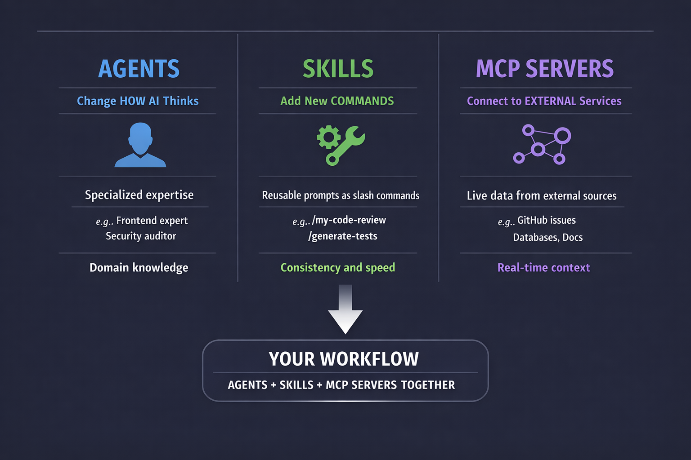

# Chapter 05: Skills System

> **What if every complex prompt you write could become a single command?**

In this chapter, you'll learn to turn repetitive prompts into reusable slash commands. While agents change *how* Copilot thinks, skills add new things Copilot can *do*. You'll see how `/commit` generates perfect conventional commit messages in seconds, create your own `/security-audit` skill that enforces OWASP checks, and build team-standard commands that ensure consistent code quality across your organization.

## Learning Objectives

By the end of this chapter, you'll be able to:

- Find and install community skills
- Use skills in your workflows
- Create custom skills with SKILL.md files
- Know when to use skills vs agents vs MCP

---

## Real-World Analogy: Power Tools

A general-purpose drill is useful, but specialized attachments make it powerful:

| Attachment | Purpose |
|------------|---------|
| Screwdriver bit | Drive screws quickly |
| Hole saw | Cut perfect circles |
| Sanding disc | Smooth surfaces |
| Wire brush | Remove rust |

Skills work the same way. They're specialized tools that extend what Copilot can do.


*Skills are specialized attachments that extend what Copilot can do*

---

## Understanding Skills

Skills are reusable prompts and instructions packaged as slash commands. Each skill becomes available as `/<skill-name>`:

```bash
copilot

> /my-code-review
# Runs your custom code review skill

> /generate-tests
# Runs test generation with your preferred settings

> /security-audit
# Runs security analysis with specific checklist
```

### Skills vs Agents vs MCP



*Three ways to extend Copilot CLI: Agents change how it thinks, Skills add commands, MCP connects to external services*

| Feature | What It Does | When to Use |
|---------|--------------|-------------|
| **Agents** | Changes how AI thinks | Need specialized expertise |
| **Skills** | Adds new slash commands | Repetitive tasks with specific prompts |
| **MCP** | Connects external services | Need live data from APIs |

**Quick rule**: If you find yourself writing the same complex prompt repeatedly, turn it into a skill.

---

## Finding and Managing Skills

### List Available Skills

```bash
copilot

> /skills list

Installed skills:
  - my-code-review
  - security-audit
  - documentation-generator

> /skills list --all
# Shows built-in skills too
```

### Install a Skill

```bash
> /skills add security-scanner

Installing security-scanner...
Done! Use with: /security-scanner
```

### Get Skill Info

```bash
> /skills info my-code-review

my-code-review
Description: Comprehensive code review with security, performance, and maintainability checks
Location: ~/.copilot/skills/my-code-review/SKILL.md
```

<details>
<summary>🎬 See it in action!</summary>


</details>

### Remove a Skill

```bash
> /skills remove old-skill

Removed old-skill
```

### Reload After Changes

When you edit a skill, reload to pick up changes:

```bash
> /skills reload

Reloaded 3 skills from ~/.copilot/skills/
```

### Skills Command Reference

| Command | What It Does |
|---------|--------------|
| `/skills list` | Show installed skills |
| `/skills list --all` | Show all skills including built-ins |
| `/skills add <name>` | Install a skill |
| `/skills remove <name>` | Uninstall a skill |
| `/skills info <name>` | Show skill details and location |
| `/skills reload` | Reload skills after editing |

---

## From 5 Minutes to 5 Seconds

> 💡 **Why show benefits first?** Before diving into how to create skills, let's see *why* they're worth learning. Once you see the time savings, the "how" will make more sense.

### Before Skills: The /commit Struggle

Every commit, you think:
1. What changed? (look at diff)
2. What type of change? (feat/fix/refactor?)
3. What's the scope? (auth/api/ui?)
4. How do I describe it? (write, rewrite, rewrite again)

Time: **2-5 minutes** per commit. Mental energy: significant.

### After Skills: One Command

```bash
copilot

> /commit
```

**What happens**:
```
Analyzing staged changes...

Changes detected:
- Modified: src/auth/login.js (added refresh token logic)
- Added: src/auth/refreshToken.js (new file)
- Modified: tests/auth.test.js (new tests)

Generated commit message:
feat(auth): add JWT refresh token rotation

- Implement automatic token refresh before expiration
- Add refresh token storage in httpOnly cookie
- Update auth tests for new refresh flow

Closes #42
```

Time: **3 seconds**. Mental energy: zero.

**The difference**: What took 5 minutes of context-switching now takes a single command.

---

## Consistency at Scale: The /pr-review Skill

Imagine your team has a 10-point PR checklist. Without a skill:

```bash
copilot

> Review this PR for:
> 1. Security vulnerabilities
> 2. Test coverage
> 3. No console.log statements
> 4. Error handling
> 5. TypeScript strict compliance
> 6. No TODOs without issue references
> 7. API documentation
> 8. Breaking changes documented
> 9. Migration steps if needed
> 10. Performance implications
```

**Time to type**: 30+ seconds. **Easy to forget items**: Very.

With a `/pr-review` skill:

```bash
> /pr-review @src/
```

**Time**: 2 seconds. **Consistent every time**: Yes.

The skill encodes your team's standards so nobody forgets step 6 or 9.

---

## Using Skills

Skills are invoked as slash commands. When you type `/skill-name`, Copilot loads the skill's instructions and applies them to your request.

### Basic Usage

```bash
copilot

> /security-audit @src/api/

# The security-audit skill applies its specialized
# checklist and analysis patterns to the files
```

### Skills with Context

```bash
> @src/auth/login.js /my-code-review

# Provides file context, then applies the skill
```

### Combining Skills with Agents

```bash
# Start with an agent
copilot --agent backend

> /generate-tests @src/services/userService.js

# The backend agent's expertise combines with
# the test generation skill
```

### Skills with Arguments

Skills can accept arguments after the skill name:

```bash
> /security-audit @src/api/ --severity high

# Some skills support flags or parameters
# Check skill documentation with /skills info
```

---

## Skill Locations

Skills are discovered from these locations (in order of priority):

| Location | Scope | Priority |
|----------|-------|----------|
| `.github/skills/` | Project-specific | Highest (overrides global) |
| `~/.copilot/skills/` | Global (all projects) | Lower |

**Pro tip**: Create project-specific skills in `.github/skills/` to share them with your team via git.

---

## Creating Custom Skills

Skills are stored in `~/.copilot/skills/` (global) or `.github/skills/` (project-specific).

### Skill Structure

```
~/.copilot/skills/
└── my-skill/
    └── SKILL.md      # Skill definition and instructions
```

### SKILL.md Format

Skills use a simple markdown format with YAML frontmatter:

```markdown
---
name: my-code-review
description: Comprehensive code review with security, performance, and maintainability checks
---

# Code Review

When reviewing code, check for:

## Security
- SQL injection vulnerabilities
- XSS vulnerabilities
- Authentication/authorization issues
- Sensitive data exposure

## Performance
- N+1 query problems
- Unnecessary loops or computations
- Memory leaks
- Blocking operations

## Maintainability
- Function length (flag functions > 50 lines)
- Code duplication
- Missing error handling
- Unclear naming

## Output Format
Provide issues as a numbered list with severity:
- [CRITICAL] - Must fix before merge
- [HIGH] - Should fix before merge
- [MEDIUM] - Should address soon
- [LOW] - Nice to have
```

### Creating Your First Skill

```bash
# Create skill directory
mkdir -p ~/.copilot/skills/security-audit

# Create the SKILL.md file
cat > ~/.copilot/skills/security-audit/SKILL.md << 'EOF'
---
name: security-audit
description: Security-focused code review checking OWASP (Open Web Application Security Project) Top 10 vulnerabilities
---

# Security Audit

Perform a security audit checking for:

## Injection Vulnerabilities
- SQL injection (string concatenation in queries)
- Command injection (unsanitized shell commands)
- LDAP injection
- XPath injection

## Authentication Issues
- Hardcoded credentials
- Weak password requirements
- Missing rate limiting
- Session management flaws

## Sensitive Data
- Plaintext passwords
- API keys in code
- Logging sensitive information
- Missing encryption

## Access Control
- Missing authorization checks
- Insecure direct object references
- Path traversal vulnerabilities

## Output
For each issue found, provide:
1. File and line number
2. Vulnerability type
3. Severity (CRITICAL/HIGH/MEDIUM/LOW)
4. Recommended fix
EOF

# Reload skills
copilot

> /skills reload

# Test your skill
> /security-audit @src/api/
```

---

## Hands-On Examples

### Example 1: Test Generation Skill

```bash
# Create skill
mkdir -p ~/.copilot/skills/generate-tests

cat > ~/.copilot/skills/generate-tests/SKILL.md << 'EOF'
---
name: generate-tests
description: Generate comprehensive unit tests with edge cases
---

# Test Generation

Generate unit tests that include:

## Test Structure
- Use describe/it blocks (Jest style)
- One assertion per test when possible
- Clear test names describing expected behavior

## Coverage
- Happy path scenarios
- Edge cases: null, undefined, empty strings
- Boundary values
- Error scenarios

## Mocking
- Mock external dependencies
- Mock API calls with realistic responses
- Mock database operations

## Output
Provide complete, runnable test file.
EOF
```

### Example 2: Documentation Skill

```bash
mkdir -p ~/.copilot/skills/document-api

cat > ~/.copilot/skills/document-api/SKILL.md << 'EOF'
---
name: document-api
description: Generate API documentation in OpenAPI format
---

# API Documentation

Generate documentation including:

## For Each Endpoint
- HTTP method and path
- Description of what it does
- Request parameters (query, path, body)
- Request body schema with examples
- Response schemas for all status codes
- Example requests and responses

## Format
Output as OpenAPI 3.0 YAML.
EOF
```

### Example 3: Commit Message Skill

```bash
mkdir -p ~/.copilot/skills/commit-msg

cat > ~/.copilot/skills/commit-msg/SKILL.md << 'EOF'
---
name: commit-msg
description: Generate conventional commit messages
---

# Commit Message Generation

Generate commit messages following Conventional Commits:

## Format
```
<type>(<scope>): <description>

[optional body]

[optional footer]
```

## Types
- feat: New feature
- fix: Bug fix
- docs: Documentation only
- style: Formatting, no code change
- refactor: Code change that neither fixes nor adds
- perf: Performance improvement
- test: Adding tests
- chore: Maintenance

## Rules
- Subject line max 72 characters
- Use imperative mood ("add" not "added")
- Body explains what and why, not how
EOF
```

### Example 4: Team PR Review Skill

```bash
mkdir -p ~/.copilot/skills/pr-review

cat > ~/.copilot/skills/pr-review/SKILL.md << 'EOF'
---
name: pr-review
description: Team-standard PR review checklist
---

# PR Review

Review code changes against team standards:

## Security Checklist
- [ ] No hardcoded secrets or API keys
- [ ] Input validation on all user data
- [ ] SQL queries use parameterized statements
- [ ] No sensitive data in logs

## Code Quality
- [ ] Functions under 50 lines
- [ ] No console.log/print statements
- [ ] Error handling for all async operations
- [ ] No TODOs without issue references

## Testing
- [ ] New code has tests
- [ ] Edge cases covered
- [ ] No skipped tests without explanation

## Documentation
- [ ] API changes documented
- [ ] Breaking changes noted
- [ ] README updated if needed

## Output Format
Provide results as:
- ✅ PASS: Items that look good
- ⚠️ WARN: Items that could be improved
- ❌ FAIL: Items that must be fixed before merge
EOF
```

---

## 🎯 Try It Yourself

After completing the demos, try these variations:

1. **Skill Creation Challenge**: Create a `/quick-review` skill that does a 3-point checklist:
   - Security issues
   - Missing error handling
   - Unclear variable names

   Test it on userService.js.

2. **Skill Comparison**: Time yourself writing a detailed code review prompt manually. Then use `/security-audit`. How much time did the skill save?

3. **Team Skill Challenge**: Think about your team's code review checklist. Could you encode it as a skill? Write down 3 things the skill should always check.

**Self-Check**: You understand skills when you can explain the difference between a skill and an agent (skills are COMMANDS, agents change HOW the AI thinks).

---

## Assignment

### Main Challenge: Create Your Own Skills

1. Run `/skills list` to see what's installed
2. Create a skill that solves a repetitive task you do
3. Your skill should have:
   - Clear name and description
   - Specific instructions for the task
   - Expected output format
4. Test the skill on real code

**Success criteria**: You have a working custom skill that you'll actually use.

### Bonus Challenge: Share Your Skill

1. Document your skill with examples
2. Create a GitHub repo with the `copilot-skill` topic
3. Include installation instructions

---

## Troubleshooting

### Skill not found

Check the skill directory location:

```bash
# Global skills
ls ~/.copilot/skills/

# Project skills
ls .github/skills/

# Reload skills after changes
copilot
> /skills reload
```

### Skill not appearing in list

Verify the SKILL.md format:

```markdown
---
name: skill-name
description: What the skill does
---

# Instructions here
```

The frontmatter (between `---` markers) is required.

### Changes not taking effect

Reload skills after editing:

```bash
> /skills reload
```

---

## Key Takeaways

1. **Skills** add new slash commands via `/<skill-name>`
2. **Community skills** can be installed with `/skills add`
3. **Custom skills** are SKILL.md files in `~/.copilot/skills/` or `.github/skills/`
4. **Skill format** uses YAML frontmatter with markdown instructions
5. **Use skills** for repetitive prompts that need consistent behavior

---

## What's Next

Skills extend what Copilot can do with custom commands. But what about connecting to external services? That's where MCP comes in.

In **[Chapter 06: MCP Servers](../06-mcp-servers/README.md)**, you'll learn:

- What MCP (Model Context Protocol) is
- Connecting to GitHub, databases, and APIs
- Configuring MCP servers
- Multi-server workflows

---

**[← Back to Chapter 04](../04-agents-custom-instructions/README.md)** | **[Continue to Chapter 06 →](../06-mcp-servers/README.md)**
