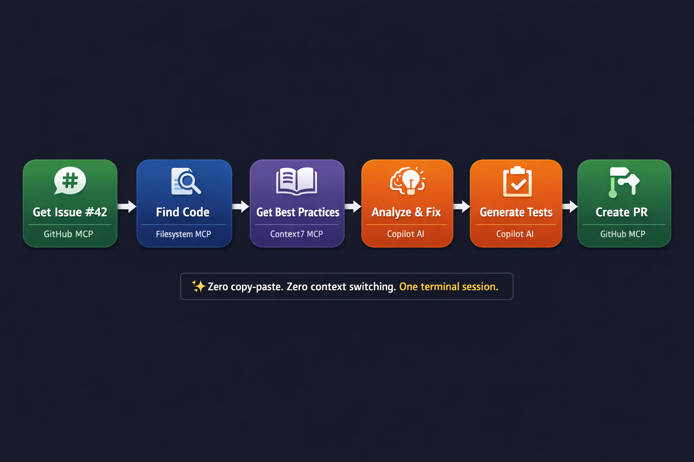

# Chapter 06: MCP Servers

> **What if Copilot could read your GitHub issues, check your database, and create PRs... all from the terminal?**

In this chapter, you'll connect Copilot to the outside world using MCP (Model Context Protocol). You'll configure servers for GitHub, filesystem access, and documentation, then experience the magic of going from "Get issue #42" to "Create a PR with the fix" - all without leaving your terminal. You'll also learn to build your own MCP servers to connect any API you need.

## Learning Objectives

By the end of this chapter, you'll be able to:

- Understand what MCP is and why it matters
- Configure MCP servers for GitHub, filesystem, and documentation
- Use MCP in your daily workflows
- Build a basic custom MCP server

---

## Real-World Analogy: Browser Extensions

Think of MCP servers like browser extensions:

| Extension | What It Does |
|-----------|--------------|
| Password manager | Connects browser to your vault |
| GitHub | Adds GitHub features to any page |
| Grammarly | Connects to writing analysis service |

MCP servers do the same thing for Copilot. They connect it to external services so it can read GitHub issues, query databases, fetch documentation, and more.


*MCP servers connect Copilot to the outside world: GitHub, databases, documentation, and more*

---

## What is MCP?

MCP (Model Context Protocol) is a standard for connecting AI assistants to external data sources.

**Without MCP:**
```bash
> What's in GitHub issue #42?

"I don't have access to GitHub. You'll need to copy and paste the issue content."
```

**With MCP:**
```bash
> What's in GitHub issue #42 of this repository?

Issue #42: Login fails with special characters
Status: Open
Labels: bug, priority-high
Description: Users report that passwords containing...
```

MCP makes Copilot aware of your actual development environment.

---

## Managing MCP Servers

Use the `/mcp` command to manage MCP servers:

```bash
copilot

> /mcp show
# Shows all configured MCP servers

> /mcp add
# Interactive setup for adding a new server

> /mcp edit server-name
# Edit an existing server configuration

> /mcp enable server-name
# Enable a disabled server

> /mcp disable server-name
# Temporarily disable a server

> /mcp delete server-name
# Remove a server
```

<details>
<summary>🎬 See it in action!</summary>


</details>

---

## MCP Configuration File

MCP servers are configured in `~/.copilot/mcp-config.json` (global) or `.copilot/mcp-config.json` (project).

### Basic Configuration Structure

```json
{
  "mcpServers": {
    "server-name": {
      "type": "local",
      "command": "npx",
      "args": ["@package/server-name"],
      "tools": ["*"]
    }
  }
}
```

---

## MCP Server 1: Filesystem

Access files with advanced capabilities beyond basic `@` syntax.

### Configuration

```json
{
  "mcpServers": {
    "filesystem": {
      "type": "local",
      "command": "npx",
      "args": ["-y", "@modelcontextprotocol/server-filesystem", "/path/to/project"],
      "tools": ["*"]
    }
  }
}
```

### Usage

Once configured, the filesystem MCP provides tools that Copilot can use automatically:

```bash
copilot

> List all markdown files in the docs folder

Found 12 markdown files:
- docs/README.md
- docs/getting-started.md
- docs/api/endpoints.md
...

> What are the file statistics for the src directory?

src/ statistics:
- Total files: 47
- JavaScript: 32 files (68%)
- TypeScript: 10 files (21%)
- JSON: 5 files (11%)
- Total lines: 4,230

> Find all TODO comments in the codebase

Found 8 TODO comments:
- src/api/users.js:23 - TODO: Add pagination
- src/services/auth.js:45 - TODO: Implement refresh tokens
...
```

---

## MCP Server 2: GitHub

Connect to GitHub for issues, PRs, and repository information.

> 💡 **Note**: The GitHub MCP server is included by default in Copilot CLI. The configuration below is for reference or if you need to customize settings.

### Additional GitHub MCP Features

The GitHub MCP server also provides access to:
- **Copilot Spaces**: Collaborative workspaces for team projects
- **Code search**: Search across repositories
- **Actions**: Query workflow runs and status

### Configuration

```json
{
  "mcpServers": {
    "github": {
      "type": "local",
      "command": "npx",
      "args": ["-y", "@modelcontextprotocol/server-github"],
      "tools": ["*"],
      "env": {
        "GITHUB_TOKEN": "${GITHUB_TOKEN}"
      }
    }
  }
}
```

### Setting Up Your Token

Get a personal access token from [github.com/settings/tokens](https://github.com/settings/tokens):

1. Click **"Generate new token (classic)"**
2. Give it a descriptive name: `Copilot CLI MCP`
3. Set expiration (90 days recommended for security)
4. Select these scopes:
   - `repo` - Full repository access (for private repos)
   - `read:org` - Read organization membership
   - `read:user` - Read user profile (optional)
5. Click **"Generate token"**
6. **Copy immediately** - you won't see it again!

Set it as an environment variable:

```bash
# Add to ~/.bashrc (Linux) or ~/.zshrc (macOS)
export GITHUB_TOKEN="ghp_your_token_here"

# Then reload your shell
source ~/.zshrc  # or source ~/.bashrc
```

**Windows (PowerShell):**
```powershell
# Add to your PowerShell profile
$env:GITHUB_TOKEN = "ghp_your_token_here"

# Or set permanently via System Properties > Environment Variables
```

**Security tips:**
- Never commit tokens to git (add to `.gitignore`)
- Use 90-day expiration and rotate regularly
- Use fine-grained tokens for even better security

### Usage

```bash
copilot

> List open issues labeled "bug" in this repository

Open bugs (5):
#42 - Login fails with special characters (high priority)
#38 - Dashboard loading slow (medium priority)
#35 - Email notifications not sending (high priority)
...

> Tell me about issue #42

Issue #42: Login fails with special characters
Opened by: jsmith (3 days ago)
Labels: bug, priority-high
Assignee: none

Description:
Users report that passwords containing special characters
like !@#$ fail to authenticate, even though they work
during registration...

Comments (2):
- @devteam: Confirmed. Reproduces with password "test!@#"
- @security: Likely an encoding issue in the auth endpoint

> Create a pull request for my current branch with a description

Created PR #45: Fix special character handling in authentication
Base: main
Head: feature/fix-special-chars
Status: Ready for review
```

---

## MCP Server 3: Context7 (Documentation)

Context7 gives Copilot access to up-to-date documentation for popular frameworks and libraries. Instead of relying on training data that might be outdated, Copilot fetches the actual current documentation.

**Supported documentation sources include:**
- React, Vue, Angular, Svelte
- Node.js, Express, Fastify
- TypeScript, JavaScript
- PostgreSQL, MongoDB, Redis
- And many more...

### Configuration

```json
{
  "mcpServers": {
    "context7": {
      "type": "local",
      "command": "npx",
      "args": ["-y", "@upstash/context7-mcp"],
      "tools": ["*"]
    }
  }
}
```

**No API key required** - Context7 works out of the box.

### Usage

```bash
copilot

> What's the best practice for useEffect cleanup in React?

From React Documentation:

## useEffect Cleanup

Effects can return a cleanup function that runs before
the component unmounts or before the effect runs again:

```jsx
useEffect(() => {
  const subscription = props.source.subscribe();
  return () => {
    subscription.unsubscribe();
  };
}, [props.source]);
```

Common cleanup scenarios:
- Unsubscribing from subscriptions
- Cancelling fetch requests
- Clearing timeouts/intervals
- Removing event listeners

> How do I implement this in my UserProfile component?

# Copilot now knows the official React patterns
# and can apply them to your specific code
```

---

## Issue to Fix to PR: Without Leaving Terminal

This is the moment developers say "I never want to work without this again."



*Complete Issue-to-PR workflow: GitHub MCP retrieves issues and creates PRs, Filesystem MCP finds code, Context7 MCP provides best practices, and Copilot handles analysis and fixes*

### The Complete Workflow (No Copy-Paste, No Context Switching)

```bash
copilot

> Get the details of GitHub issue #42

Issue #42: Login fails with special characters in password
Status: Open
Priority: High
Reporter: jsmith (3 days ago)

Description:
Users report that passwords containing special characters like !@#$
fail to authenticate, even when they worked during registration.

Steps to reproduce:
1. Create account with password "Test!@#123"
2. Log out
3. Try to log in - fails with "Invalid credentials"

Comments:
- @devteam: Confirmed. Issue is in password encoding.
- @security: High priority - blocking some users from logging in.

> Find the authentication code that handles login

Found: src/auth/login.js

[Shows relevant code with the password handling function]

> Based on the issue and the code, what's causing this bug?

Analysis:
Line 34 passes the password through encodeURIComponent()
before hashing. Special characters are encoded differently
during login vs registration, causing hash mismatch.

Fix: Remove encoding or apply consistently in both places.

> Fix the bug and create a pull request that references issue #42

✓ Created branch: fix/issue-42-special-chars
✓ Modified: src/auth/login.js (removed duplicate encoding)
✓ Modified: tests/auth.test.js (added special char test cases)
✓ Created PR #48: Fix special character handling in authentication

PR URL: https://github.com/org/repo/pull/48
```

**The result**: Issue investigation → root cause analysis → fix implementation → PR creation. **Zero copy-paste. Zero context switching. One terminal session.**

---

### The Repository Health Dashboard

Get a complete picture of your codebase health in 30 seconds:

```bash
copilot

> Give me a health report for this repository:
> 1. Count all TODO and FIXME comments
> 2. List open GitHub issues by priority
> 3. Find any issues labeled "security"
> 4. Show me which files have the most lines of code

Repository Health Report
========================

📝 Technical Debt:
- TODO comments: 23 (src/api: 12, src/services: 8, src/utils: 3)
- FIXME comments: 5 (all in src/legacy/)

🐛 Open Issues: 12
- Critical: 2 (#42 auth bug, #39 data loss)
- High: 4
- Medium: 5
- Low: 1

🔒 Security Issues: 3
- #42: Authentication bypass (HIGH)
- #31: XSS in comments (MEDIUM)
- #28: Rate limiting missing (MEDIUM)

📊 Largest Files:
1. src/services/orderProcessor.js (847 lines) ⚠️
2. src/api/users.js (523 lines)
3. src/utils/validators.js (412 lines)

Recommendations:
- Address critical issues #42 and #39 immediately
- Consider splitting orderProcessor.js (>500 lines)
- 23 TODOs suggest technical debt accumulation
```

**The result**: Multiple data sources aggregated in 30 seconds. Manual process: 1+ hour of clicking around GitHub, running grep, counting lines.

---

## Multi-Server Workflows

The real power comes from combining servers:


*Combine GitHub, Filesystem, and Documentation servers for powerful integrated workflows*

```bash
copilot

# Step 1: Understand the issue from GitHub
> Tell me about issue #42

# Step 2: Find related code
> Search for "authenticate" in the src directory

# Step 3: Get best practices
> What are the best practices for input sanitization in authentication?

# Step 4: Synthesize a solution
> Based on the issue, the code, and best practices, suggest a fix

# Step 5: Create the PR
> Create a pull request with this fix
```

### Example: Complete Bug Investigation

```bash
copilot

> Get the details of issue #42
# Learn about the bug

> Show me src/auth/login.js
# See the relevant code

> What are the best practices for password validation?
# Understand the right approach

> Analyze the bug and suggest a fix based on what we found

# Copilot synthesizes information from all three sources

> Implement the fix

> Create a pull request titled "Fix: Handle special characters in password validation"
```

---

## Complete Configuration File

Here's a full `mcp-config.json` with all three servers:

```json
{
  "mcpServers": {
    "filesystem": {
      "type": "local",
      "command": "npx",
      "args": ["-y", "@modelcontextprotocol/server-filesystem", "."],
      "tools": ["*"]
    },
    "github": {
      "type": "local",
      "command": "npx",
      "args": ["-y", "@modelcontextprotocol/server-github"],
      "tools": ["*"],
      "env": {
        "GITHUB_TOKEN": "${GITHUB_TOKEN}"
      }
    },
    "context7": {
      "type": "local",
      "command": "npx",
      "args": ["-y", "@upstash/context7-mcp"],
      "tools": ["*"]
    }
  }
}
```

Save this as `~/.copilot/mcp-config.json` for global access or `.copilot/mcp-config.json` for project-specific configuration.

---

## Web Access with web_fetch

Copilot CLI includes a built-in `web_fetch` tool that can retrieve content from URLs. You can control which URLs are accessible via your configuration:

```json
// ~/.copilot/config.json
{
  "permissions": {
    "allowedUrls": [
      "https://api.github.com/**",
      "https://docs.github.com/**",
      "https://*.npmjs.org/**"
    ],
    "blockedUrls": [
      "http://**"  // Block non-HTTPS URLs
    ]
  }
}
```

**Usage:**
```bash
copilot

> Fetch and summarize the README from https://github.com/facebook/react
```

---

## Building a Custom MCP Server (Advanced)

> ⚠️ **Advanced Section**: This section requires familiarity with TypeScript and Node.js development. Feel free to skip this on your first read-through and return when you need to connect Copilot to custom APIs.

Want to connect Copilot to your own APIs? Here's how to build a simple MCP server.

### Project Setup

```bash
mkdir weather-mcp-server
cd weather-mcp-server
npm init -y
npm install @modelcontextprotocol/sdk
```

### Server Implementation

```typescript
// index.ts
import { Server } from '@modelcontextprotocol/sdk/server/index.js';
import { StdioServerTransport } from '@modelcontextprotocol/sdk/server/stdio.js';

const server = new Server({
  name: 'weather-server',
  version: '1.0.0'
}, {
  capabilities: {
    tools: {}
  }
});

// Define available tools
server.setRequestHandler('tools/list', async () => ({
  tools: [
    {
      name: 'get_weather',
      description: 'Get current weather for a city',
      inputSchema: {
        type: 'object',
        properties: {
          city: {
            type: 'string',
            description: 'City name'
          }
        },
        required: ['city']
      }
    }
  ]
}));

// Handle tool calls
server.setRequestHandler('tools/call', async (request) => {
  const { name, arguments: args } = request.params;

  if (name === 'get_weather') {
    // In real implementation, call weather API
    const weather = await fetchWeather(args.city);
    return {
      content: [{
        type: 'text',
        text: `Weather in ${args.city}: ${weather.temp}F, ${weather.conditions}`
      }]
    };
  }

  throw new Error(`Unknown tool: ${name}`);
});

async function fetchWeather(city: string) {
  // Mock implementation - replace with actual API call
  return {
    temp: 72,
    conditions: 'Partly cloudy'
  };
}

// Start server
const transport = new StdioServerTransport();
await server.connect(transport);
```

### Configuration

```json
{
  "mcpServers": {
    "weather": {
      "type": "local",
      "command": "node",
      "args": ["./weather-mcp-server/index.js"],
      "tools": ["*"]
    }
  }
}
```

### Usage

```bash
copilot

> What's the weather in Seattle?

Weather in Seattle: 72F, Partly cloudy
```

---

## 🎯 Try It Yourself

After completing the demos, try these variations:

1. **MCP Status Check**: Run `/mcp show` to see what servers are configured. If GitHub isn't set up, try adding it with your token.

2. **Documentation Challenge**: If Context7 MCP is configured, ask for official documentation on a framework you use:
   ```bash
   copilot
   > Show me the React documentation for useEffect cleanup patterns
   ```

3. **Workflow Challenge**: Try the complete issue-to-PR workflow on a real (or test) repository. Even if you don't have issues, you can create one and immediately work through it.

**Self-Check**: You understand MCP when you can explain why "Get GitHub issue #42" is better than copying and pasting issue content into the prompt.

---

## Assignment

### Main Challenge: Configure and Use MCP

1. Set up `mcp-config.json` with at least filesystem and GitHub servers
2. Get your GitHub token and configure it
3. Use MCP to:
   - List files in your project
   - Get information about an issue or PR
   - Create a workflow that uses both servers

**Success criteria**: You can seamlessly access GitHub and filesystem data from within Copilot.

### Bonus Challenge: Build a Custom MCP Server

1. Choose an API you use regularly (weather, stocks, your company API)
2. Build a basic MCP server that connects to it
3. Add it to your configuration
4. Use it in a workflow with other servers

---

## Troubleshooting

### "MCP server not found"

Check that:
1. The npm package exists: `npm view @modelcontextprotocol/server-github`
2. Your configuration is valid JSON
3. The server name matches your config

Use `/mcp show` to see the current configuration.

### "GitHub authentication failed"

Verify your token is set:
```bash
echo $GITHUB_TOKEN  # Should show your token
```

If empty, set it in your shell profile (~/.bashrc or ~/.zshrc):
```bash
export GITHUB_TOKEN="ghp_your_token_here"
```

### "MCP server failed to start"

Check the server logs:
```bash
# Run the server command manually to see errors
npx -y @modelcontextprotocol/server-github
```

### MCP tools not available

Make sure the server is enabled:
```bash
copilot

> /mcp show
# Check if server is listed and enabled

> /mcp enable server-name
# Enable if disabled
```

---

## Key Takeaways

1. **MCP** connects Copilot to external services
2. **Common servers** include filesystem, GitHub, and documentation
3. **Configuration** lives in `~/.copilot/mcp-config.json`
4. **Multi-server workflows** combine data from multiple sources
5. **Custom servers** let you connect any API
6. **Manage servers** with the `/mcp` command

---

## What's Next

You now have all the building blocks: modes, context, workflows, agents, skills, and MCP. Time to put them all together.

In **[Chapter 07: Advanced Workflows](../07-advanced-workflows/README.md)**, you'll learn:

- Combining agents, skills, and MCP
- Production-ready automation
- Complete feature development workflows
- Best practices for team environments

---

**[← Back to Chapter 05](../05-skills/README.md)** | **[Continue to Chapter 07 →](../07-advanced-workflows/README.md)**
